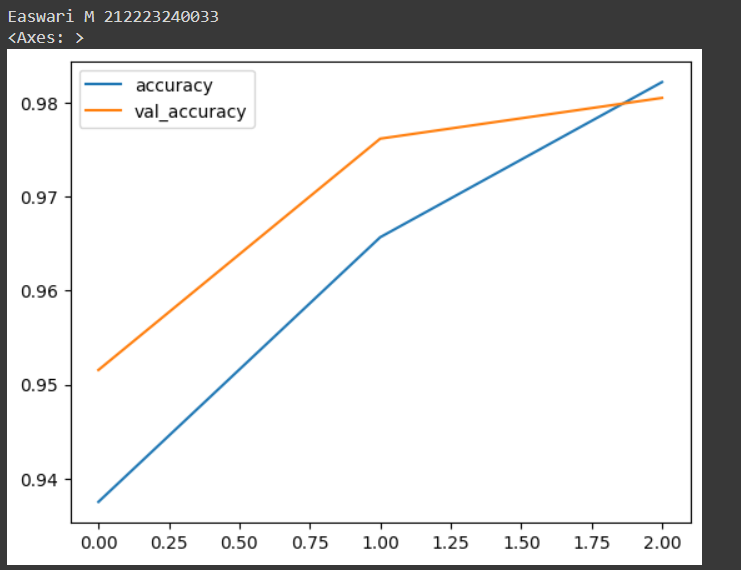

# Named Entity Recognition

## AIM

To develop an LSTM-based model for recognizing the named entities in the text.

## Problem Statement and Dataset
 
Named Entity Recognition (NER) involves the identification and classification of named entities such as persons, organizations, locations, dates, and more within unstructured text.In this experiment we will develop a LSTM model for recognizing the named entities in the given text in the dataset.For this a model is created bidirectional layers and compiled with categorical crossentrophy.Thus the model is created and the desiredv output is obtained.

## DESIGN STEPS

### STEP 1: Import the necessary packages.

### STEP 2: Read the dataset, and fill the null values using forward fill.

### STEP 3: Create a list of words, and tags.

### STEP-4: Build a model and do necessary preprocessing methods.

### STEP-5: Compile and fit the model.Plot the graphs.

## PROGRAM
```
Program developed by : Easwari M
Register No : 212223240033
```

```
import matplotlib.pyplot as plt
import pandas as pd
import numpy as np
from tensorflow.keras.preprocessing import sequence
from sklearn.model_selection import train_test_split
from keras import layers
from keras.models import Model

data = pd.read_csv("ner_dataset.csv", encoding="latin1")

data.head(50)

data = data.fillna(method="ffill")

data.head(50)

print("Unique words in corpus:", data['Word'].nunique())
print("Unique tags in corpus:", data['Tag'].nunique())

words=list(data['Word'].unique())
words.append("ENDPAD")
tags=list(data['Tag'].unique())

print("Unique tags are:", tags)

num_words = len(words)
num_tags = len(tags)

num_words

class SentenceGetter(object):
    def __init__(self, data):
        self.n_sent = 1
        self.data = data
        self.empty = False
        agg_func = lambda s: [(w, p, t) for w, p, t in zip(s["Word"].values.tolist(),
                                                           s["POS"].values.tolist(),
                                                           s["Tag"].values.tolist())]
        self.grouped = self.data.groupby("Sentence #").apply(agg_func)
        self.sentences = [s for s in self.grouped]
    
    def get_next(self):
        try:
            s = self.grouped["Sentence: {}".format(self.n_sent)]
            self.n_sent += 1
            return s
        except:
            return None

getter = SentenceGetter(data)
sentences = getter.sentences

len(sentences)

sentences[0]

word2idx = {w: i + 1 for i, w in enumerate(words)}
tag2idx = {t: i for i, t in enumerate(tags)}

word2idx

plt.hist([len(s) for s in sentences], bins=50)
plt.show()

X1 = [[word2idx[w[0]] for w in s] for s in sentences]

type(X1[0])

X1[0]

max_len = 50

nums = [[1], [2, 3], [4, 5, 6]]
sequence.pad_sequences(nums)

nums = [[1], [2, 3], [4, 5, 6]]
sequence.pad_sequences(nums,maxlen=2)

X = sequence.pad_sequences(maxlen=max_len,
                  sequences=X1, padding="post",
                  value=num_words-1)

X[0]

y1 = [[tag2idx[w[2]] for w in s] for s in sentences]

y = sequence.pad_sequences(maxlen=max_len,
                  sequences=y1,
                  padding="post",
                  value=tag2idx["O"])

X_train, X_test, y_train, y_test = train_test_split(X, y,
                                                    test_size=0.2, random_state=1)

X_train[0]

y_train[0]

input_word = layers.Input(shape=(max_len,))
embedding_layer = layers.Embedding(input_dim=num_words,output_dim=50,
                                   input_length=max_len)(input_word)
dropout = layers.SpatialDropout1D(0.1)(embedding_layer)
bid_lstm = layers.Bidirectional(
    layers.LSTM(units=100,return_sequences=True,
                recurrent_dropout=0.1))(dropout)
output = layers.TimeDistributed(
    layers.Dense(num_tags,activation="softmax"))(bid_lstm)
model = Model(input_word, output)

model.summary()

model.compile(optimizer="adam",
              loss="sparse_categorical_crossentropy",
              metrics=["accuracy"])

history = model.fit(
    x=X_train,
    y=y_train,
    validation_data=(X_test,y_test),
    batch_size=32, 
    epochs=3,
)

metrics = pd.DataFrame(model.history.history)
metrics.head()

print("Easwari M 212223240033")
metrics[['accuracy','val_accuracy']].plot()

print("Easwari M 212223240033")
metrics[['loss','val_loss']].plot()

print("Easwari M 212223240033")
i = 20
p = model.predict(np.array([X_test[i]]))
p = np.argmax(p, axis=-1)
y_true = y_test[i]
print("{:15}{:5}\t {}\n".format("Word", "True", "Pred"))
print("-" *30)
for w, true, pred in zip(X_test[i], y_true, p[0]):
    print("{:15}{}\t{}".format(words[w-1], tags[true], tags[pred]))

```

## OUTPUT

### Training Loss, Validation Loss Vs Iteration Plot



### Sample Text Prediction


## RESULT

Thus, an LSTM-based model for recognizing the named entities  successfully developed.


